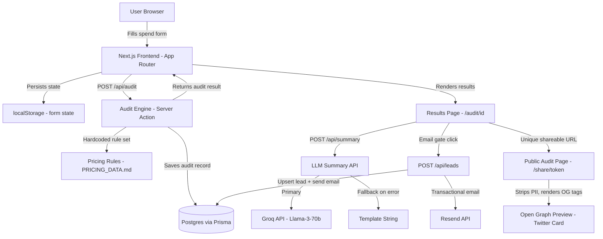

# ARCHITECTURE.md

## System Diagram

---

## Data Flow: From Input to Audit Result

1. **User fills the spend form.** Tool name, plan, monthly spend (entered manually), and seat count are collected for each AI tool. Team size and primary use case are collected globally. Form state is serialised to `localStorage` on every change so the page reload doesn't reset progress.

2. **Submit fires a Next.js Server Action (`/api/audit`).** The payload is validated with Zod. No authentication is required.

3. **The audit engine runs.** For each tool/plan combination, a deterministic rule set (see `src/lib/audit-engine.ts`) evaluates:
   - Whether the user is on the cheapest plan that fits their stated seat count and use case.
   - Whether a same-vendor cheaper plan exists and is meaningfully cheaper (>10% savings threshold to avoid noise).
   - Whether a cross-vendor alternative is substantially cheaper for the declared use case.
   - Whether API-direct billing would be cheaper than their subscription, given their stated monthly spend vs the implied per-seat cost.

4. **The audit record is persisted to Postgres** via Prisma. A `shareToken` (nanoid, 12 chars) is generated. The PII-stripped public record is stored alongside the full record.

5. **The results page renders server-side.** Open Graph `<meta>` tags are injected using Next.js Metadata API, keyed to the audit ID. This means every unique shareable URL gets its own preview card showing the savings headline.

6. **AI summary is generated async.** After the page renders, the client fires a request to `/api/summary`. The prompt (see `PROMPTS.md`) is sent to Groq (`llama-3-70b-8192`). On API failure, a deterministic template string is returned. The summary appears in a skeleton-loading state until resolved.

7. **Lead capture.** After seeing results, the user can optionally enter email + company + role. This fires `/api/leads`, which upserts the record and triggers a Resend transactional email. For audits showing >$500/mo savings, the Credex CTA is surfaced prominently in the email.

---

## Why This Stack

| Choice | Reasoning |
|--------|-----------|
| **Next.js 16 (App Router)** | Server Components for SSR + granular streaming. Metadata API for dynamic OG tags per audit. Vercel-native deploy with zero config. |
| **TypeScript** | End-to-end type safety: Zod schemas validate API payloads, Prisma generates DB types, component props are typed. Catches an entire class of bugs at compile time instead of runtime. |
| **Prisma + Postgres** | Type-safe ORM with automatic migration tracking. Supabase / Render / Neon all expose a Postgres connection string, so the provider is swappable. |
| **Tailwind CSS v4** | No build-step CSS. Utility-first keeps component styles co-located and avoids stylesheet drift. |
| **Vitest** | Faster than Jest for TypeScript projects; compatible with the same `describe`/`it` API. Native ESM support without transform configuration overhead. |
| **Resend** | Developer-friendly transactional email with a generous free tier (3,000 emails/month). React email templates work natively. |
| **Groq SDK** | Sub-400 ms inference on Llama-3-70b makes the AI summary feel instant. On API failure, a deterministic template string is returned so the page is never broken or empty. |

---

## What Would Change at 10,000 Audits / Day

At ~10k audits/day the current single-Postgres-instance architecture begins to strain in predictable places:

1. **Database reads.** The results page currently hits the DB on every request for the audit record. At scale, move audit records to a read replica or cache them in Redis (Upstash) with a 24-hour TTL. Most audit records are immutable after creation.

2. **LLM summary generation.** Currently synchronous from the client's perspective (shown as a skeleton). At scale, move this to a background queue (Inngest or a simple Postgres-backed job table) so the results page renders immediately and the summary is pushed via Server-Sent Events or polled.

3. **Lead storage writes.** Upserts are low-frequency (only users who opt in) but the email send is synchronous. Decouple the email send into a queue worker so an Resend outage doesn't block the API response.

4. **Rate limiting.** The current honeypot + rate limit on `/api/leads` is per-IP in memory. At scale, move rate limit state to Redis so it works across multiple Vercel edge regions.

5. **Audit engine pricing data.** Currently baked into a TypeScript constant. At 10k/day it's worth moving to a database table with a CMS so Credex can update pricing without a code deploy.